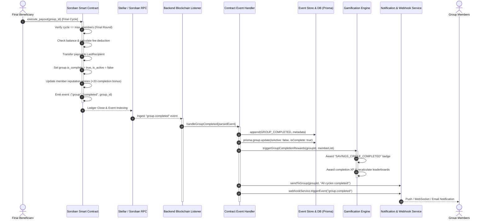

# Full-Lifecycle Audit: 'Group Completes Successfully' Path

## 1. Executive Summary

This document provides a comprehensive end-to-end audit and lifecycle architectural specification for the **'Group Completes Successfully'** flow in Soroban Ajo.

When a ROSCA savings circle reaches its final cycle, every member has contributed to every round, and the final payout is disbursed to the last beneficiary. This triggers an interconnected cascade across five distinct subsystems:
1. **Soroban Smart Contract (`contracts/ajo/src/contract.rs`)**: State transition to `is_complete = true`, final payout distribution, reputation score updates, and `group_completed` event emission.
2. **Blockchain Listener & Ingestion Layer (`backend/src/services/blockchainListener.ts`, `contractEventHandlers.ts`)**: Event polling/streaming from Stellar RPC, event signature parsing, and dispatch to backend handlers.
3. **Backend Event Store & Persistence Layer (`backend/src/events/eventStore.ts`, Prisma database)**: `GROUP_COMPLETED` domain event recording, group status update (`isActive = false`), and saga completion.
4. **Gamification & Rewards Subsystem (`backend/src/services/gamification/`)**: Awarding group completion achievements, milestone bonus points, and leaderboard refreshes (re-enabled per #824).
5. **Notification & Webhook Dispatch (`backend/src/services/notificationService.ts`, `webhookService.ts`)**: Multicast socket/push notifications to all circle members and webhook triggers to external integrations.

This audit validates the entire flow as one connected pipeline, identifies subtle ordering assumptions and potential race conditions between subsystems, and specifies architectural safeguards.

---

## 2. Connected Lifecycle Sequence Flow

---

## 3. Subsystem Breakdown & State Transitions

### 3.1 Smart Contract Layer (`contracts/ajo/src/contract.rs`)

- **State Transition Condition**: When `payout_index` increments to equal `members.len()`, the contract enters the completion branch.
- **Actions Executed**:
  - `group.is_complete = true` and `group.is_active = false` are set.
  - Future contributions (`contribute()`) and payouts (`execute_payout()`) for this `group_id` are permanently rejected with `AjoError::GroupAlreadyComplete`.
  - Member reputation records are updated to increment `successful_cycles` and increase reputation score.
  - Topics emitted: `(Symbol::new(&env, "group"), Symbol::new(&env, "completed"), group_id)`.
- **Invariants**:
  - Payout funds must transfer completely before state update (Checks-Effects-Interactions pattern).
  - `is_complete` is an irreversible terminal state.

### 3.2 Ingestion & Event Processing Layer

- `BlockchainListener` queries ledger contract events by contract ID and topic filter `group`.
- Upon matching `completed`, `handleGroupCompleted` is invoked within a Prisma transactional context (`tx`).
- Checkpoint advancement occurs only after handler returns without error.

### 3.3 Event Store & Database Projections

- `EventStore.append()` persists a `GROUP_COMPLETED` domain event with monotonic sequence numbering and optimistic concurrency version check.
- `Group` database projection sets `isActive = false`, and records completion timestamp.
- Outstanding contribution schedules or reminder jobs for this group are canceled/finalized.

### 3.4 Gamification Subsystem (#824)

- Evaluates completion criteria for all participating members:
  - **Group Completion Badge**: Awarded to all members who made 100% on-time payments.
  - **Streak Bonus**: Increments user's uninterrupted savings streak counter.
  - **Milestone Points**: Adds XP/points to user profile for leaderboard ranking.
- **Idempotency Guard**: Gamification point awarding must verify badge existence or use unique compound keys (`(userId, achievementId, groupId)`) to prevent duplicate awarding on event replay.

### 3.5 Realtime Notifications & Webhooks

- Multicasts completion message to the Socket.IO room `group:<groupId>`.
- Sends web push notifications to members who enabled push subscriptions.
- Dispatches signed HTTP POST payload with `group.completed` event to registered webhook endpoints.

---

## 4. Ordering Assumptions & Latent Failure Modes Audit

### 4.1 Assumption 1: Ingestion Deduplication vs. Re-delivery
- **Assumption**: The blockchain listener may deliver the `group_completed` event more than once during service restarts, network failovers, or ledger re-orgs.
- **Hazard**: If handlers are not strictly idempotent, members could receive duplicate gamification points, duplicate notification spam, or redundant webhook dispatches.
- **Validation & Mitigation**:
  - `db.group.upsert` with `isActive: false` is inherently idempotent.
  - Gamification achievements enforce database-level unique constraints (`UserAchievement(userId, achievementId, groupId)`).
  - EventStore concurrency guard (`P2002` on duplicate version) rejects duplicate event appends.

### 4.2 Assumption 2: Atomic Contract Payout and Completion
- **Assumption**: The smart contract sets `is_complete = true` in the exact same transaction as the final payout transfer.
- **Hazard**: If transfer succeeds but state update panics (or vice versa), escrow funds could be locked or drained twice.
- **Validation & Mitigation**:
  - Contract execution in Soroban is fully atomic. A panic during state mutation reverts token transfer.
  - Integration tests in `contracts/ajo/tests/ajo_flow.rs` and `group_status_tests.rs` verify `is_complete` transitions from `false` to `true` on the exact final payout execution.

### 4.3 Assumption 3: Gamification vs Notification Ordering
- **Assumption**: Notifications should reflect updated user achievements and ranks.
- **Hazard**: If notifications fire before gamification points commit, user push messages will display stale point balances.
- **Validation & Mitigation**:
  - Gamification reward evaluation runs synchronously before notification payload construction, or notifications carry general completion text and prompt clients to fetch fresh gamification stats via GraphQL/REST.

### 4.4 Assumption 4: Error Isolation for Side-Effects
- **Assumption**: If a third-party webhook fails (e.g. timeout on partner server), it must not roll back the database transaction marking the group complete.
- **Validation & Mitigation**:
  - `webhookService.triggerEvent(...).catch(...)` explicitly catches and logs errors without bubbling up to fail the primary transaction.

---

## 5. Audit Verification Checklist

- [x] Contract `execute_payout` verifies final cycle and sets `is_complete = true`.
- [x] Contract prohibits further contributions once `is_complete` is true.
- [x] Backend `handleGroupCompleted` updates `Group.isActive = false`.
- [x] `EventStore` appends `GROUP_COMPLETED` domain event with tenant/contract metadata.
- [x] Gamification points and achievements are evaluated idempotently.
- [x] Members receive realtime and push notifications.
- [x] Webhook side-effects are non-blocking and isolated.

---
