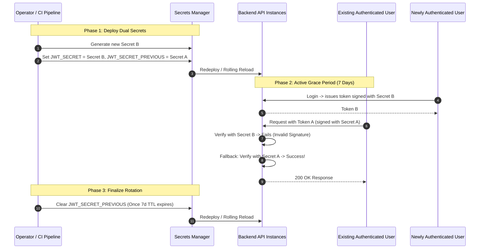

# Secrets Management & Key Rotation Architecture

## 1. Executive Summary

In a decentralized financial application handling real monetary value across Soroban smart contracts and off-chain backend services, **secrets management and cryptographic key lifecycle** directly safeguard user funds, authentication integrity, and administrative controls.

Historically, `.env.example` contained bare variable placeholders (e.g. `JWT_SECRET=`) without minimum entropy specifications, rotation policies, or runbooks. This document establishes:
1. **Cryptographic Entropy & Generation Standards** for all secret categories.
2. **Production Secrets Architecture** (AWS Secrets Manager / HashiCorp Vault / Doppler integration).
3. **Zero-Downtime Secret Rotation Runbooks** (JWT dual-secret rotation, Soroban Keeper key rotation, Database and Redis credentials).
4. **Emergency Compromise Response Protocols**.

---

## 2. Secret Classification & Entropy Requirements

| Secret Identifier | Classification | Minimum Entropy Requirement | Recommended Generation Method | Rotation Cadence |
| :--- | :--- | :--- | :--- | :--- |
| **`JWT_SECRET`** | **CRITICAL** | $\ge 256$ bits (32 bytes cryptographically secure pseudo-random numbers). | `openssl rand -base64 32` or `node -e "console.log(crypto.randomBytes(32).toString('hex'))"` | 90 days |
| **`ADMIN_JWT_SECRET`** | **CRITICAL** | $\ge 256$ bits (32 bytes CSPRNG). | `openssl rand -base64 32` | 90 days |
| **`SOROBAN_KEEPER_SECRET`** | **HIGH** | Ed25519 Secret Seed (32 bytes). | `stellar keys generate` | 180 days / on staff departure |
| **`DATABASE_URL` (Password)** | **CRITICAL** | $\ge 192$ bits ($\ge 24$ alphanumeric chars). | `openssl rand -hex 24` | 180 days |
| **`REDIS_URL` (Password)** | **HIGH** | $\ge 192$ bits ($\ge 24$ chars). | `openssl rand -hex 24` | 180 days |
| **`WEBHOOK_SIGNING_SECRET`**| **MEDIUM** | $\ge 256$ bits (32 bytes HMAC key). | `openssl rand -hex 32` | 180 days |
| **Third-Party API Keys** | **HIGH** | Vendor generated (SendGrid, Twilio, Stripe, FCM). | Provider Security Dashboard | Annually / on breach |

---

## 3. Production Secrets Management Architecture

In staging and production environments:
1. **Never commit raw secrets to source control or container images.**
2. **Secrets Manager Integration**: Secrets must be injected into container runtimes via a dedicated secrets store:
   - **AWS Secrets Manager / AWS Systems Manager Parameter Store**: Secrets fetched at task launch via AWS ECS/EKS task definition IAM roles.
   - **HashiCorp Vault**: Dynamic secrets and automated leasing/revocation for database credentials.
   - **Doppler / Infisical**: Encrypted secret injection for CI/CD pipelines and developer staging environments.
3. **Access Audit Logging**: Access to production secrets is monitored with CloudTrail / Vault audit logs. Alerts fire on unauthorized read attempts.

---

## 4. Zero-Downtime JWT Secret Rotation Runbook

Soroban Ajo implements **Dual-Secret Verification** to rotate JWT signing keys without forcing active users to re-authenticate or experiencing authentication downtime.



### Step-by-Step Execution:

#### Phase 1: Generate New Key & Deploy Dual Secrets
1. Generate a new high-entropy secret:
   ```bash
   NEW_SECRET=$(openssl rand -base64 32)
   ```
2. Update the environment variables in your deployment / secrets manager:
   - `JWT_SECRET`: `<NEW_SECRET>` (new active signing key)
   - `JWT_SECRET_PREVIOUS`: `<OLD_SECRET>` (fallback verification key)
3. Execute a zero-downtime rolling restart of backend services.

#### Phase 2: Active Grace Period
- All new logins and token refreshes are signed with the new `JWT_SECRET`.
- Existing sessions signed with `JWT_SECRET_PREVIOUS` continue to validate seamlessly through `AuthService.verifyToken()`.
- Monitor logs for any unexpected signature failures.

#### Phase 3: Decommission Outgoing Secret
- After the token expiration window has passed (e.g. 7 days as configured in `JWT_EXPIRES_IN`), all legacy tokens have naturally expired.
- Remove `JWT_SECRET_PREVIOUS` and redeploy.

---

## 5. Soroban Keeper Secret Rotation Runbook

The `SOROBAN_KEEPER_SECRET` is the Stellar Ed25519 secret seed used by backend workers to submit permissionless `execute_payout` transactions:
1. Generate a new Stellar keypair:
   ```bash
   stellar keys generate keeper-v2 --network testnet
   ```
2. Fund the new public address with minimum XLM balance for transaction base fees (e.g. 10 XLM).
3. Update `SOROBAN_KEEPER_SECRET` in Secrets Manager.
4. Deploy the updated backend instance.
5. Sweep any remaining XLM balance from the old keeper address back to the treasury wallet.

---

## 6. Emergency Compromise Response Runbook

If a secret (such as `JWT_SECRET` or database credentials) is accidentally committed to a repository or leaked:
1. **Immediate Revocation**:
   - Immediately replace `JWT_SECRET` in Secrets Manager without setting `JWT_SECRET_PREVIOUS` (instantly invalidates all adversary-minted tokens).
   - All active users will be required to log in again via their Stellar wallet signature.
2. **Rotate Database & Redis Passwords**:
   - Issue a database `ALTER USER ajo WITH PASSWORD '...';` command.
   - Update connection strings in Secrets Manager and restart application pods.
3. **Audit Off-Chain Logs**:
   - Inspect access logs for anomalous admin requests or unauthorized token claims during the exposure window.

---
