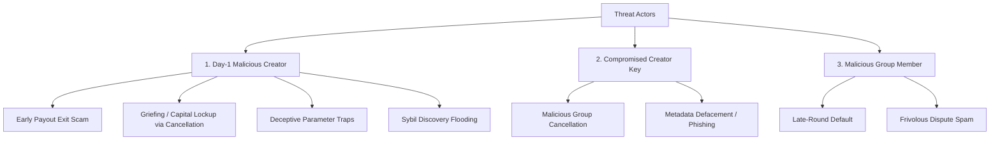
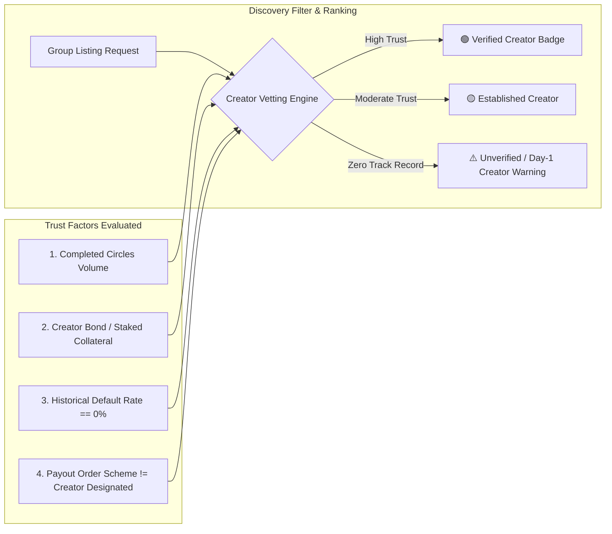

# Threat Model: Malicious Group Creator vs. Malicious Group Member

## 1. Executive Summary

In Soroban Ajo, smart contracts grant specific privileged capabilities to the `creator` address of a savings group (`create_group`, `cancel_group`, `set_group_metadata`, parameter definition, payout ordering). However, because `create_group` is permissionless and requires no upfront identity vetting or staking by default, an adversary can instantiate groups with malicious intent from inception.

This document provides a comprehensive threat model analyzing:
1. **The hierarchy of privileges**: Creator-only powers vs. ordinary member capabilities.
2. **Threat Actor Profiles**: Day-1 Malicious Creator vs. Compromised Creator Key vs. Malicious Group Member.
3. **STRIDE Analysis & Attack Vectors**: Detailed breakdown of exploit scenarios and worst-case blast radii.
4. **Group Discovery & Due-Diligence Signals**: How the platform can evaluate and display creator risk signals before prospective members commit funds.
5. **Mitigation Roadmap**: Smart contract, backend, and interface controls.

---

## 2. Privilege Matrix: Creator vs. Member

| Operation / Capability | Actor Authority | Smart Contract / API Guard | Description & Power Differential |
| :--- | :--- | :--- | :--- |
| **`create_group`** | Anyone (Permissionless) | None (Requires caller signature) | Creator defines contribution amount, cycle interval, max members, token address, collateral requirements, and payout scheme. |
| **Member #0 Allocation** | Creator | Implicit contract initialization | The creator is automatically inserted as Member index 0 (`members.push_back(creator)`). |
| **`cancel_group`** | Creator Only | `if group.creator != caller -> OnlyCreatorCanCancel` | Unilaterally cancels a group before the first payout, refunding deposits and terminating the circle. Ordinary members cannot initiate cancellation. |
| **`set_group_metadata`** | Creator Only | `if group.creator != caller -> Unauthorized` | Creator can update group title, description, category, icon, and external documentation links. |
| **`contribute`** | Any Member | `members.contains(caller)` | Members can deposit the required round contribution during the contribution window. |
| **`execute_payout`** | Any Member / Caller | Validation of round completion | Triggers contract transfer to the scheduled cycle recipient. |
| **Dispute Filing** | Any Member | `members.contains(caller)` | Can file disputes against non-paying or defaulting participants. |

---

## 3. Threat Actor Archetypes & Impact Analysis

### 3.1 Profile 1: Day-1 Malicious Creator (Highest Systemic Risk)
- **Motivation**: Direct financial theft, deposit lockup/griefing, Sybil manipulation, or phishing.
- **Worst-Case Impact**:
  - **Early Payout Exit Scam**: In fixed-order or creator-controlled payout schemes, the creator takes Position 0 (receiving Round 1's aggregated pool from all members) and immediately defaults on subsequent rounds, stealing $(N - 1) \times \text{contribution}$.
  - **Capital Lockup & Griefing**: Creator attracts member deposits, then stalls or calls `cancel_group` right before payout, locking up member liquidity and causing opportunity loss.
  - **Deceptive Parameter Bait-and-Switch**: Creator sets obscure token contracts, excessive collateral requirements, or misleading cycle durations in metadata that mislead novice users.
  - **Discovery Phishing**: Creator populates public group discovery listings with high-yield promotional metadata linking to malicious external dApps.

### 3.2 Profile 2: Compromised Legitimate Creator Key
- **Motivation**: Opportunistic damage or ransom by an external attacker who obtained the private key.
- **Worst-Case Impact**:
  - Attacker cannot steal locked contract funds directly (since payouts follow contract rules), but can execute `cancel_group` to disrupt active groups before Round 1 payout.
  - Attacker can deface group metadata with phishing links.

### 3.3 Profile 3: Malicious Group Member
- **Motivation**: Free-riding (collecting payout in round $k$ and defaulting in rounds $k+1 \dots N$).
- **Worst-Case Impact**:
  - Blast radius is strictly bounded to a single member's obligation.
  - Member cannot cancel the group, alter rules, manipulate other members' payout order, or change group metadata.

---

## 4. STRIDE Threat Model Matrix

| Threat Category (STRIDE) | Attack Vector | Day-1 Creator Vector | Member Vector | Impact Severity |
| :--- | :--- | :--- | :--- | :--- |
| **Spoofing** | Impersonating a trusted community organizer. | Creates group named after reputable entities / influencers. | Joins group with spoofed profile name. | **HIGH** (Creator) / **LOW** (Member) |
| **Tampering** | Altering metadata or payout mechanics. | Modifies group description to inject malicious phishing URLs via `set_group_metadata`. | Cannot tamper with contract state. | **HIGH** (Creator) / **NONE** (Member) |
| **Repudiation** | Denying participation or obligation. | Creator abandons group after receiving first payout. | Member stops contributing after their turn. | **HIGH** (Creator) / **MEDIUM** (Member) |
| **Information Disclosure** | Harvesting participant wallet addresses. | Creator creates bait groups to index active high-net-worth Stellar wallets. | Can only observe co-members in joined group. | **MEDIUM** (Creator) / **LOW** (Member) |
| **Denial of Service** | Disrupting group progress. | Calls `cancel_group` right as group fills, wasting gas and locking capital. | Delays contribution until window expiration. | **HIGH** (Creator) / **MEDIUM** (Member) |
| **Elevation of Privilege** | Exploiting creator-only functions. | Monopolizes position 0 in payout order and dictates group parameters without member quorum. | Cannot elevate privileges. | **CRITICAL** (Creator) / **NONE** (Member) |

---

## 5. Group Discovery & Due-Diligence Signals

To protect prospective members browsing public groups, the platform must never treat all creators equally. Group discovery listings must compute and display explicit **Creator Trust Signals**:

### 5.1 Due-Diligence Signals Surfaceable in UI

1. **Creator Track Record Badge**:
   - `New Creator` (0 completed groups): Prominent warning: *"This creator has not completed any savings circles on Soroban Ajo. Exercise caution."*
   - `Verified Tier` ($\ge 3$ successfully completed groups without defaults).
2. **Payout Order Mechanism Transparency**:
   - If payout order is **Fixed/Creator-Assigned** and Creator is in Position 0: Display high-visibility indicator: *"⚠️ Creator receives the first payout."*
   - If payout order is **Verifiable Random Shuffle (VRF)**: Display trust badge: *"🔒 Tamper-Proof Randomized Payout Order."*
3. **Creator Stake / Security Bond**:
   - Surfaces whether the creator has locked an upfront creator bond in escrow that slashes upon creator default.
4. **Collateral & Token Verification**:
   - Verified asset badge for standard Stellar USDC / XLM vs. unverified custom SAC token warning.

---

## 6. Architectural & Contract Mitigations

1. **Decentralized Payout Ordering**: Default to contract-enforced randomized shuffle or bidding instead of static creator-assigned slots.
2. **Member Quorum for Cancellation**: Replace unilateral `OnlyCreatorCanCancel` with a member voting threshold (e.g. $> 50\%$ member approval required to cancel once $>2$ members have joined).
3. **Creator Stake Requirement**: Introduce an optional or tier-enforced `creator_bond` locked until `is_complete = true`.
4. **Immutable / Timelocked Metadata**: Restrict metadata mutations once group reaches active state to prevent bait-and-switch phishing.

---
